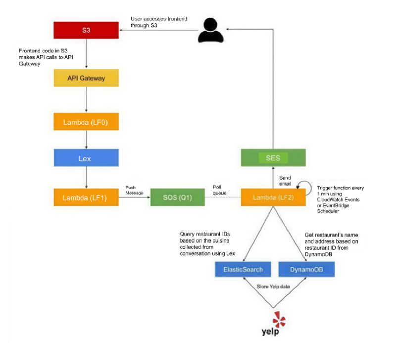

# Dining Concierge Chatbot - Cloud Computing Assignment 1

**Team Members:** Sharayu Rasal (N10802566 - srr10019) and Rohan Gore (N19332535 - rmg9725) ** 
**Course:** Cloud Computing Fall 2025  
**Assignment:** Assignment 1 - Serverless Dining Concierge

## 🎯 Project Overview

A serverless dining concierge chatbot that helps users find restaurant recommendations in Manhattan. The system collects user preferences through natural conversation and processes requests asynchronously to provide personalized dining suggestions.

## 🏗️ Architecture



### Components

- **Frontend**: Static website hosted on S3
- **API Gateway**: RESTful API with Lambda proxy integration
- **LF0 (Chat API)**: Routes messages to Lex and returns responses
- **Lex Bot**: Natural language understanding and conversation flow
- **LF1 (Validation)**: Validates user inputs and manages slot collection
- **SQS Queue**: Message queue for asynchronous processing
- **LF2 (Suggestions Worker)**: Processes requests and sends recommendations
- **DynamoDB**: Restaurant database with 1000+ Manhattan restaurants
- **ElasticSearch**: Restaurant search and filtering
- **SES**: Email delivery service
- **DLQ**: Dead Letter Queue for handling failed message processing

## ✅ Implementation Status

### Completed Tasks

#### Task 1 & 2: Frontend and Basic API
- ✅ S3 static website hosting with public access
- ✅ API Gateway with Swagger import and CORS configuration
- ✅ LF0 Lambda function with canned responses
- ✅ Frontend-backend integration with SDK generation

#### Task 3: Lex Bot Integration
- ✅ Amazon Lex V2 bot with three intents:
  - `GreetingIntent`: Welcome users
  - `ThankYouIntent`: Acknowledge thanks
  - `DiningSuggestionsIntent`: Collect dining preferences
  - `FallbackIntent`: Incase the chatbot does not understand what the user requirements are, a default fallback intent is triggered.
  - 
- ✅ LF1 Lambda code hook for validation and fulfillment
- ✅ Slot collection for: Location, Cuisine, DiningTime, NumberOfPeople, Email
- ✅ SQS queue integration for request processing
- ✅ User confirmation messages

#### Task 4: API-Lex Integration
- ✅ LF0 integration with Lex runtime API
- ✅ Session management for conversation continuity
- ✅ End-to-end conversation flow
- ✅ Proper IAM permissions and error handling

#### Task 5: Restaurant Data Collection
- ✅ Yelp API integration for Manhattan restaurants
- ✅ 1000+ restaurants across 5+ cuisines (Japanese, Chinese, Italian, Mexican, Indian)
- ✅ DynamoDB table creation with proper schema
- ✅ Data deduplication and validation

#### Task 6: ElasticSearch Integration
- ✅ OpenSearch domain setup
- ✅ Restaurant data indexing
- ✅ Search functionality implementation

#### Task 7: Email Processing
- ✅ LF2 Lambda function for SQS message processing
- ✅ Restaurant recommendation logic
- ✅ SES integration for email delivery

#### Extra Credit: Dead Letter Queue (DLQ) Implementation
- ✅ Attached DLQ to SQS queue (Q1) with `maxReceiveCount` (3-5)
- ✅ Modified LF2 to prevent message deletion from Q1 on SES email failure
- ✅ Configured messages to move to DLQ after `maxReceiveCount` exceeded
- ✅ Implemented logging of failure with `requestId` and error reason in CloudWatch Logs
- ✅ Demonstrated DLQ functionality with invalid email address test case

## 📁 Project Structure

```
├── frontend/                 # S3 static website files
│   ├── chat.html            # Main chat interface
│   ├── assets/              # CSS, JS, and SDK files
│   └── swagger/             # API specification
├── lambda-functions/        # Lambda function code
│   ├── LF0-Chat_API.py     # Chat API handler
│   ├── LF1.py              # Lex validation handler
│   └── LF2-Suggestions_Worker.py  # Email processing
├── other-scripts/           # Data collection scripts
│   └── yelp/               # Yelp API integration
├── docs/                   # Documentation
│   ├── task_summaries/     # Detailed task documentation
│   └── CC_Fall2025_Assignment1.pdf  # Assignment specification
└── README.md              
```

### 📚 Documentation: Detailed implementation guides are available in ```docs/```

---

*This project demonstrates serverless architecture patterns using AWS services including Lambda, API Gateway, Lex, CloudWatch SQS, SES, S3, DynamoDB, and ElasticSearch.*
